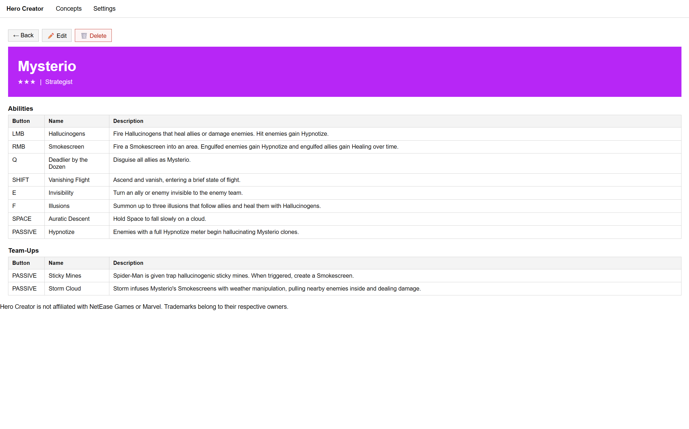
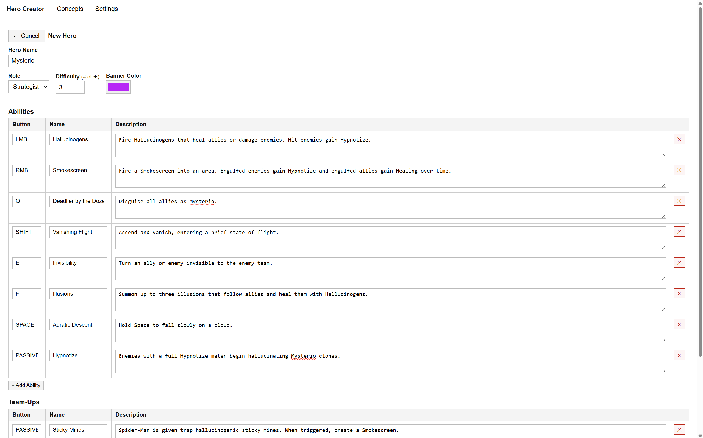
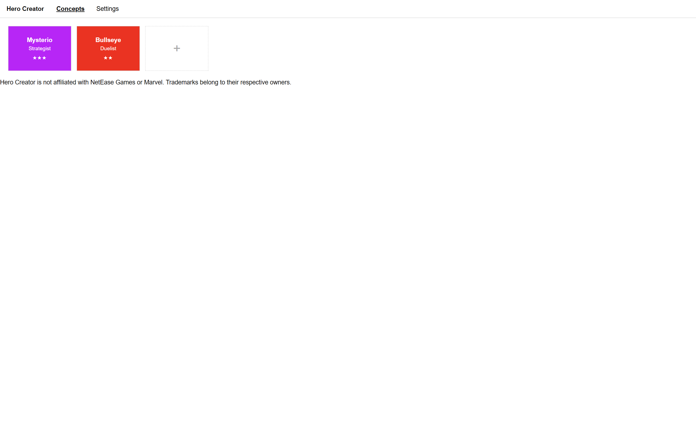

<div align="center">

# Hero Creator

**Create your own Marvel Rivals Hero concepts.**





</div>

## To Do

- [ ] Styling
- [x] Separate CSS & JS from HTML
- [x] Images
- [ ] Improved UI
- [ ] Styled buttons for concept
- [ ] Templates/presets

## Structure

```powershell
hero-creator/
├── index.html          ← shell: nav + #app div + script tags
├── css/
│   └── style.css       ← all styles
├── js/
│   ├── storage.js      ← localStorage, import/export JSON
│   ├── app.js          ← view router (fetch-based), esc/starsStr helpers, init
│   ├── concepts.js     ← grid, detail view, delete
│   └── edit.js         ← create/edit form, addRow, save
└── views/
    ├── concepts.html   ← just the grid div
    ├── detail.html     ← banner + ability/teamup tables
    ├── edit.html       ← the full edit form
    └── settings.html   ← import/export UI
```